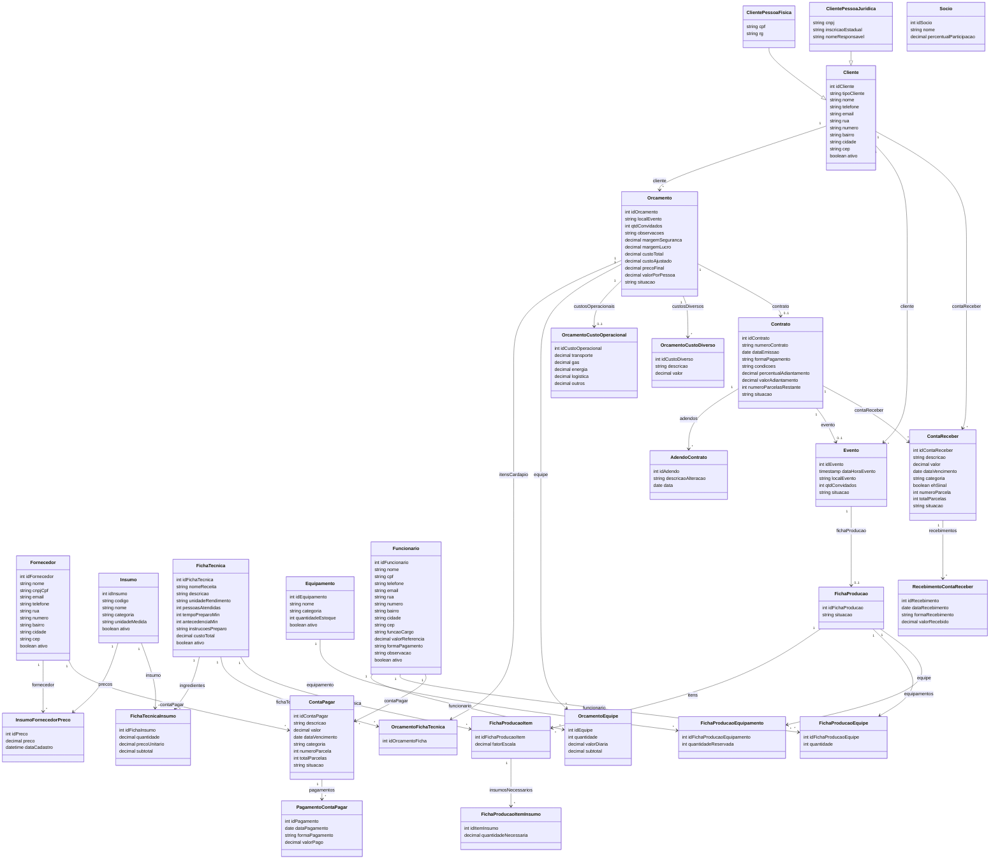

# Diagrama de Classes

> Convertido a partir do "Diagrama de Classes Final" (seção 3.1 do ERS) e
> dos diagramas de contexto por estória. Reflete a mesma estrutura do
> `docs/modelo-dados.md`, em nível de classe/objeto em vez de tabela —
> **validar contra a imagem original ao implementar**.

